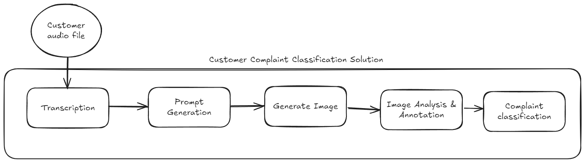

# Customer Complaint Classification Solution

This project is an end-to-end AI pipeline that converts customer complaint audio into actionable insights. It automatically transcribes voice complaints, generates visual representations to aid understanding, analyzes and annotates images for critical details, and classifies complaints into categories and subcategories to speed up support resolution.



Pipeline stages:

- **Audio Transcription:** Convert spoken complaints into text (speech-to-text).
- **Prompt Generation:** Create context-aware prompts from transcripts to guide image generation.
- **Image Generation:** Produce visual representations that highlight the issue reported.
- **Image Description & Annotation:** Analyze images to extract descriptive details and highlight problem areas.
- **Complaint Classification:** Classify each complaint into categories and subcategories for routing and analytics.

Quick start
-----------

1. Place the project overview image at `docs/overview.jpeg` (this repository includes an overview diagram to illustrate the pipeline).
2. Run the main pipeline (example):

```bash
python project/main.py
```

Notes
-----
- This repository contains modules for transcription (`project/whisper.py`), image generation (`project/dalle.py`), vision analysis (`project/vision.py`), language tasks and classification (`project/gpt.py`), and audio helpers (`project/audio/`).
- Adjust configuration and model keys in the corresponding modules before running.

Contributing
------------
Contributions, improvements, and bug fixes are welcome. Please open an issue or submit a pull request with a clear description of changes.

License
-------
See the project root for licensing details.
