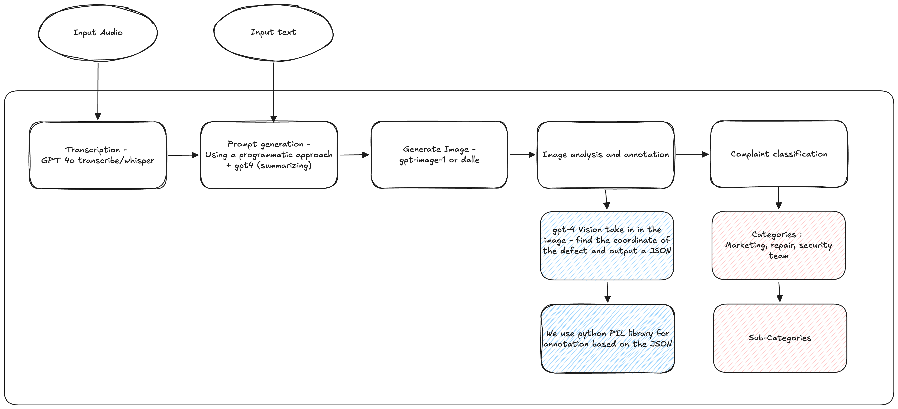

# Customer Complaint Classification Solution

End-to-end AI workflow for processing customer complaints from audio or text into structured support insights.

Quick product walkthrough: [SHOWCASE.md](SHOWCASE.md)



## What This Pipeline Does

1. Transcribes complaint audio to text.
2. Generates a complaint-focused visual prompt.
3. Generates an image representation of the complaint.
4. Analyzes the image and extracts defect locations as bounding boxes.
5. Annotates defects on the image.
6. Classifies complaint category, subcategory, and severity.

## Project Structure

```
project/
	main.py              # Async orchestrator + CLI
	whisper.py           # Speech-to-text
	dalle.py             # Image generation
	vision.py            # Vision analysis + annotation
	gpt.py               # Prompt generation + classification
	categories.json      # Category/subcategory catalog
	utils/               # Shared config, clients, prompts, IO, parsing
	audio/               # Input audio files
	output/              # Generated artifacts
```

## Setup

1. Create and activate your virtual environment.
2. Install dependencies:

```bash
pip install -e .
```

3. Add environment variables in `.env` (or your shell):
- `SPEECH_TO_TEXT_MODEL_ENDPOINT`
- `SPEECH_TO_TEXT_MODEL_KEY`
- `IMAGE_GENERATION_MODEL_ENDPOINT`
- `IMAGE_GENERATION_MODEL_KEY`
- `CONVERSATION_MODEL_ENDPOINT`
- `CONVERSATION_MODEL_KEY`

Notes:
- Endpoint values can be full Azure deployment URLs; deployment name and `api-version` are auto-parsed.
- You can also set explicit deployment/API version overrides via `*_MODEL_DEPLOYMENT` and `*_MODEL_API_VERSION`.

## Run

Bellow `python` can be replaced by `uv run` if you use uv.

Single audio complaint:

```bash
python project/main.py --audio project/audio/example.wav
```

Direct text complaint:

```bash
python project/main.py --text "The blender arrived with a cracked jar and does not turn on."
```

Text complaint from a file:

```bash
python project/main.py --text-file project/textual_complaints/apple-watch-defect.txt
```

Batch process all files under `project/audio/`:

```bash
python project/main.py
```

Batch process all text complaints under `project/textual_complaints/`:

```bash
python project/main.py --text-dir project/textual_complaints
```

Batch with custom directory and concurrency:

```bash
python project/main.py --audio-dir project/audio --concurrency 4
```

Lower image generation cost (default is already `medium`):

```bash
python project/main.py --audio project/audio/example.wav --image-quality low
```

Fail fast if any model step runs too long (example: 90 seconds per step):

```bash
python project/main.py --text "Damaged product complaint" --step-timeout 90
```

The console includes a lightweight stage tracker showing start/completion time,
prompt preview, output image paths, and formatted classification summary.

Dry run (no external model calls, useful for integration checks):

```bash
python project/main.py --text "Damaged product on arrival" --dry-run
```

## Output Artifacts

For each complaint, outputs are written under signal-based folders:

- Text input: `project/output/<defect-signal-slug>/`
- Text file input: `project/output/<text-file-stem>/`
- Audio input: `project/output/<audio-file-stem>/`

- `transcription.txt`
- `prompt.txt`
- `generated_image.png`
- `image_description.txt`
- `image_analysis.json`
- `annotated_image.png`
- `classification.json`
- `classification.txt`
- `<original-audio-file>` (copied for audio-driven complaints)

A run-level summary is saved as `project/output/run_summary.json`.

## Rubric Coverage

- Transcription and prompt generation: `transcription.txt`, `prompt.txt`
- Visual representation: `generated_image.png`
- Description and annotation: `image_description.txt`, `image_analysis.json`, `annotated_image.png`
- Category/subcategory classification: `classification.txt`, `classification.json`
- Seamless orchestration: `project/main.py` async pipeline and `run_summary.json`

## Engineering Docs

- `docs/architecture.md`: system and async workflow design.
- `docs/rubric-checklist.md`: checklist against submission criteria.
- `docs/methods-and-files.md`: method-by-method file guide for implementation traceability.

## Module Notes

- `project/whisper.py`: `transcribe_audio()` + async wrapper
- `project/dalle.py`: `generate_image()` + async wrapper
- `project/vision.py`: `describe_image()`, `annotate_image()`, `analyze_and_annotate_image()`
- `project/gpt.py`: `generate_image_prompt()`, `classify_with_gpt()`, `load_categories()`
