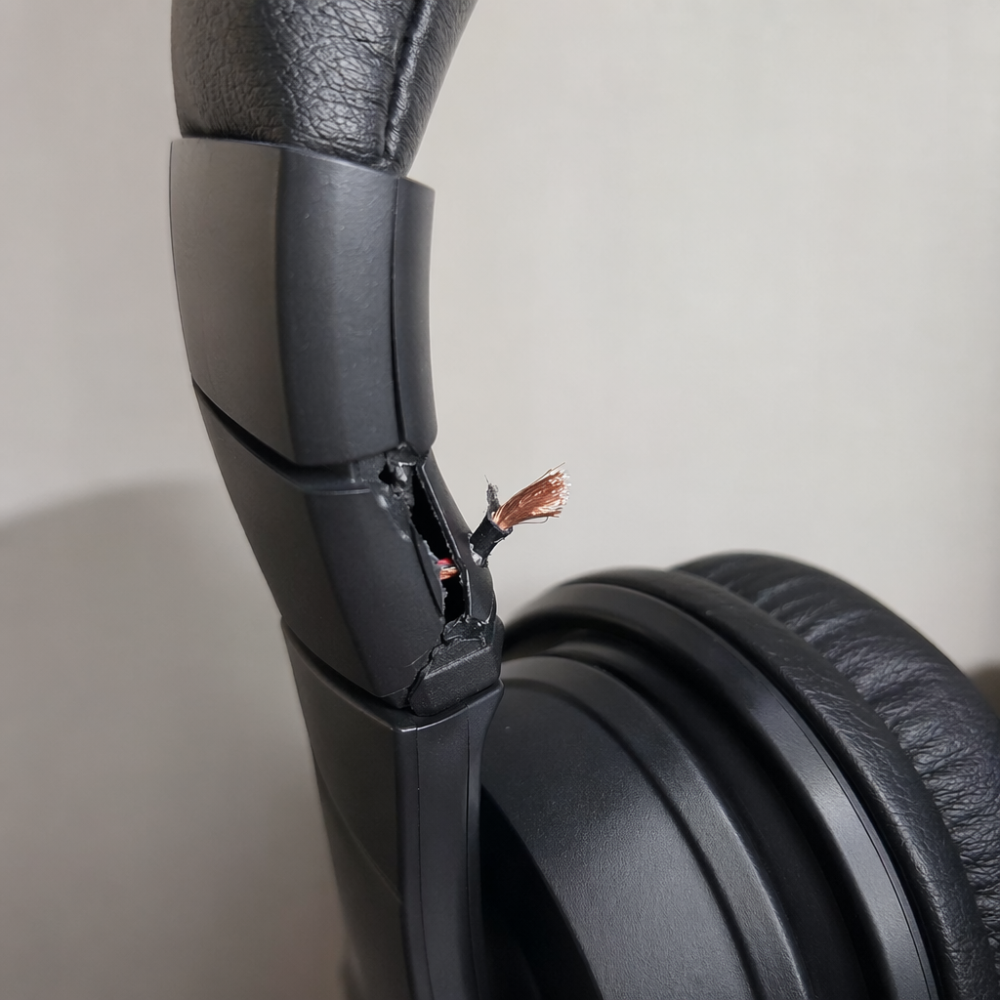
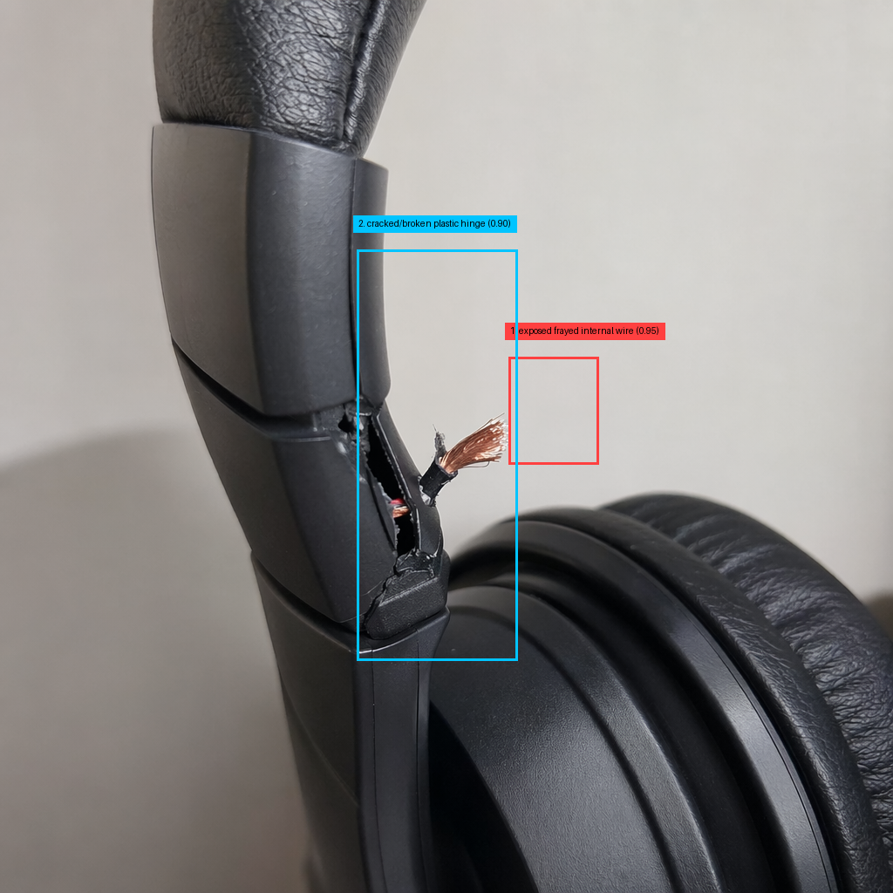
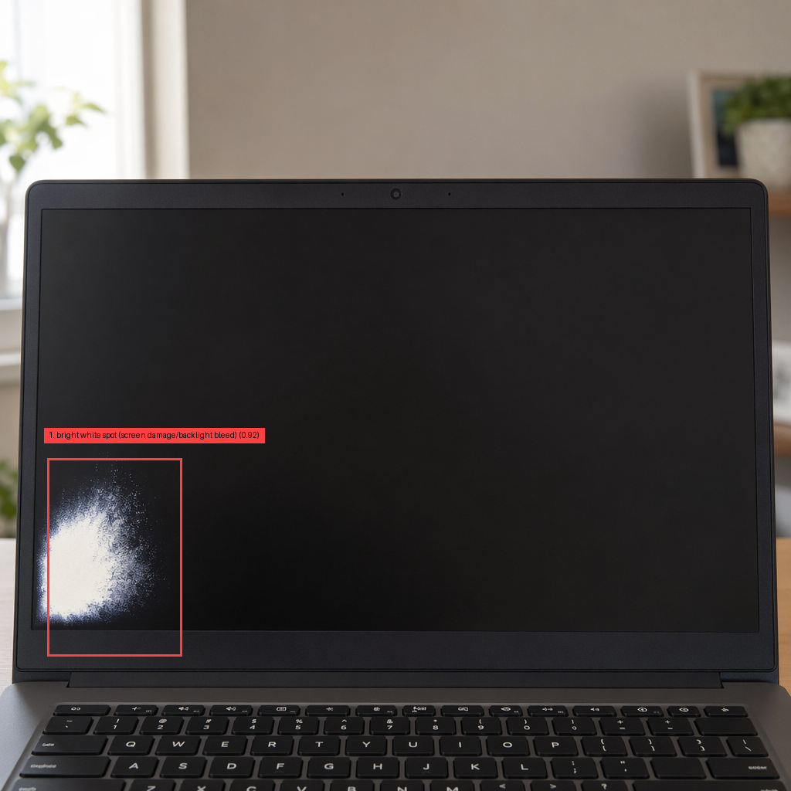

# Product Showcase: Customer Complaint Classification

This is a practical, reviewer-friendly showcase of the product in action.

## What The Product Does

It converts customer complaint signals (audio or text) into triage-ready outputs:

- Transcription
- Defect-focused image prompt
- Generated defect image
- Structured defect localization (JSON)
- Annotated image with bounding boxes
- Category, subcategory, severity, confidence, rationale

All artifacts are saved in one complaint-specific output folder.

## Stack

- Python 3.13
- OpenAI Python SDK with Azure OpenAI deployments
- Speech transcription: gpt-4o-transcribe
- Vision and reasoning: gpt-5-mini
- Image generation: gpt-image-2
- Pillow for annotation rendering
- Async orchestration with asyncio

## End-to-End Architecture

## Live Console Snapshot

## Case Study 1: Headset Defect (Primary Example)

Complaint signal summary:

> Left headphone side not working, visible cut wire near the left ear cup hinge.

Transcription:

[project/output/headphone-complaints/transcription.txt](project/output/headphone-complaints/transcription.txt)

Generated image:

Annotated image:

Classification output:

[project/output/headphone-complaints/classification.json](project/output/headphone-complaints/classification.json)

Result:

- Category: Repair
- Subcategory: Damaged Product
- Severity: high

---

## Case Study 2: Computer (Laptop) Defect

Complaint signal summary:

> New laptop screen became black with a large white spot at the bottom-left area.

Transcription:

[project/output/laptop-complaint/transcription.txt](project/output/laptop-complaint/transcription.txt)

Generated image:

Annotated image:

Classification output:

[project/output/laptop-complaint/classification.json](project/output/laptop-complaint/classification.json)

Result:

- Category: Repair
- Subcategory: Functional Failure
- Severity: high

---

## Case Study 3: Apple Watch Defect

Complaint signal summary:

> Promised straps missing and screen scratches visible after unboxing.

Transcription:

[project/output/apple-watch-defect/transcription.txt](project/output/apple-watch-defect/transcription.txt)

Generated image:

Annotated image:

Classification output:

[project/output/apple-watch-defect/classification.json](project/output/apple-watch-defect/classification.json)

Result:

- Category: Repair
- Subcategory: Missing Parts
- Severity: high

---

## Output Contract (Per Complaint Folder)

Each complaint folder under `project/output/<complaint-id>/` contains:

- transcription.txt
- prompt.txt
- generated_image.png
- image_description.txt
- image_analysis.json
- annotated_image.png
- classification.json
- classification.txt
- Original input audio file (for audio-driven runs)

Run-level summary is stored in [project/output/run_summary.json](project/output/run_summary.json).

## Quick Reviewer Checklist

1. Confirm transcription aligns with complaint signal.
2. Confirm generated image reflects reported defect context.
3. Confirm annotated boxes align with `image_analysis.json` defects.
4. Confirm classification and severity are coherent with complaint + vision output.
5. Confirm all artifacts are present in each complaint folder.
