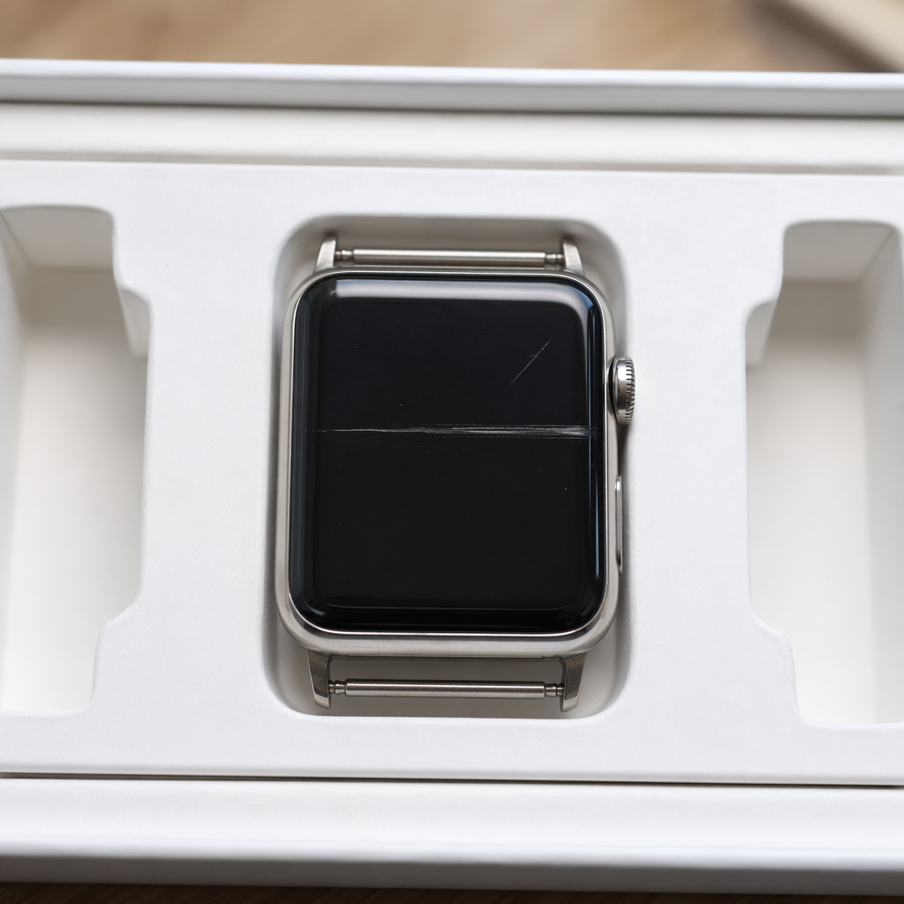
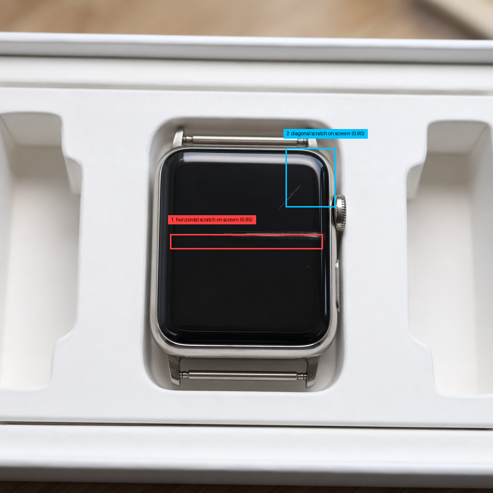

# Product Showcase: Customer Complaint Classification

This document is a practical walkthrough of the product in action.

## Product Snapshot

This application converts unstructured customer complaints into structured triage outputs for support teams.

It takes audio or text complaint signals and automatically produces:

- Complaint transcription
- Defect-focused generation prompt
- Generated complaint image
- Defect localization and annotation
- Category, subcategory, and severity classification

All artifacts are saved in one complaint folder so support and QA can review the full decision trail quickly.

## Who This Is For

- Support operations teams triaging high complaint volume
- QA and product teams tracking defect signals
- Technical reviewers validating the end-to-end AI workflow

## What Is Used

- Python 3.13
- OpenAI Python SDK with Azure OpenAI deployments
- Speech transcription model: gpt-4o-transcribe
- Language and multimodal analysis model: gpt-5-mini
- Image generation model: gpt-image-2
- Pillow for annotation rendering
- Async orchestration with asyncio

## End-to-End Architecture

## Live Demonstration: One Complaint, Full Trace

### Step 1. Run the pipeline

Audio complaint example:

    uv run project/main.py --audio project/audio/apple\ watch\ defect.mp3 --step-timeout 150

Text-file complaint example:

    uv run project/main.py --text-file project/textual_complaints/complaint1.txt --step-timeout 150

### Step 2. Console progress and timing

The run tracker shows each stage start/end, timings, and produced files.

### Step 3. Input and context extraction

Input signal is converted to complaint text and used to build a defect-specific visual prompt.

Transcription evidence:
See [project/output/apple-watch-defect/transcription.txt](project/output/apple-watch-defect/transcription.txt)

Prompt evidence:
See [project/output/apple-watch-defect/prompt.txt](project/output/apple-watch-defect/prompt.txt)

### Step 4. Visual reconstruction of the complaint

The image model generates a realistic product-defect scene from complaint context.

### Step 5. Defect localization and annotation

The vision stage returns structured defect JSON with normalized bounding boxes and confidence.

JSON evidence:
See [project/output/apple-watch-defect/image_analysis.json](project/output/apple-watch-defect/image_analysis.json)

Annotated output:

### Step 6. Triage-ready complaint classification

The final decision includes category, subcategory, severity, confidence, and rationale.

Classification evidence:
See [project/output/apple-watch-defect/classification.json](project/output/apple-watch-defect/classification.json)

## What Reviewers Should Verify Quickly

1. The complaint text and generated prompt are consistent with the issue.
2. The generated image reflects the reported defect context.
3. Bounding boxes in annotation match the defects described in JSON.
4. Final category and severity are coherent with transcript + image analysis.
5. All expected artifacts exist in one folder for each complaint.

## Output Package Per Complaint

Each complaint has a complete artifact set under a dedicated folder in project/output.

- transcription.txt
- prompt.txt
- generated_image.png
- image_description.txt
- image_analysis.json
- annotated_image.png
- classification.json
- classification.txt
- Original input audio file for audio-driven runs

Run-level summary is saved in [project/output/run_summary.json](project/output/run_summary.json).

## Why This Matters Operationally

- Faster first-response triage for support teams
- Consistent defect interpretation across complaints
- Strong traceability for quality reviews and escalation
- Easier handoff from raw customer signal to actionable category routing
